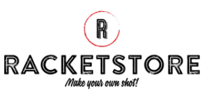

#Ecommerce RACKETSTORE - React js.-

##Introducción 

Ecommerce basado en raquetas de Tenis de 3 marcas distintas, "Babolat, Wilson y Head". El esqueleto del proyecto consiste en un componente principal que renderiza todos los productos. O bien, solamente los seleccionados por el usuario. En caso de que éste último se interese en algún producto en particular, podrá visualizar información extra del mismo en el componente ItemDetail.
Una vez decidido por la compra del mismo, existe otro componente "Cart" el cual renderizará todos los productos añadidos por el usuario y será el repsonsable de dirigir el proceso de compra.

##Recursos del proyecto
* ```RouterDom```
Para el routing (en conjunto con useParams para acceder a los parametros de las rutas).
* ```useEffect``` 
Para controlar las actualizaciones de los renderizados.
* ```useState```
Para utilizar variables de estado.
* ```Context```
Como recurso de lectura y escritura para la información relacionada al Cart.
* ```Sweetalert y React-icons```
Responsable de llevar a cabo los pop-ups y la inserción de diferentes iconos respectivamente, para proporcionar animación al proyecto.
* ```Bootstrap y React-bootstrap```
Dedicados a brindarle estilos al proyecto. Entre ellos la utilización de diferentes modulos, por ej: **Card**, **Button**, etc. Además se utilizó CSS para complementar el diseño.
* ```Firebase```
Como base de datos. Responsable tanto de alojar la información relacionada a los productos de la tienda, como asi también, lo referido al comprador del producto y a la compra en sí misma.



> Proyecto desarrollado por **Matias Karraz**.
[Ir a Github](https://github.com/mkarraz/ecommerce-karraz_matias)


[](https://app.netlify.com/sites/racketstore-mk/deploys)
